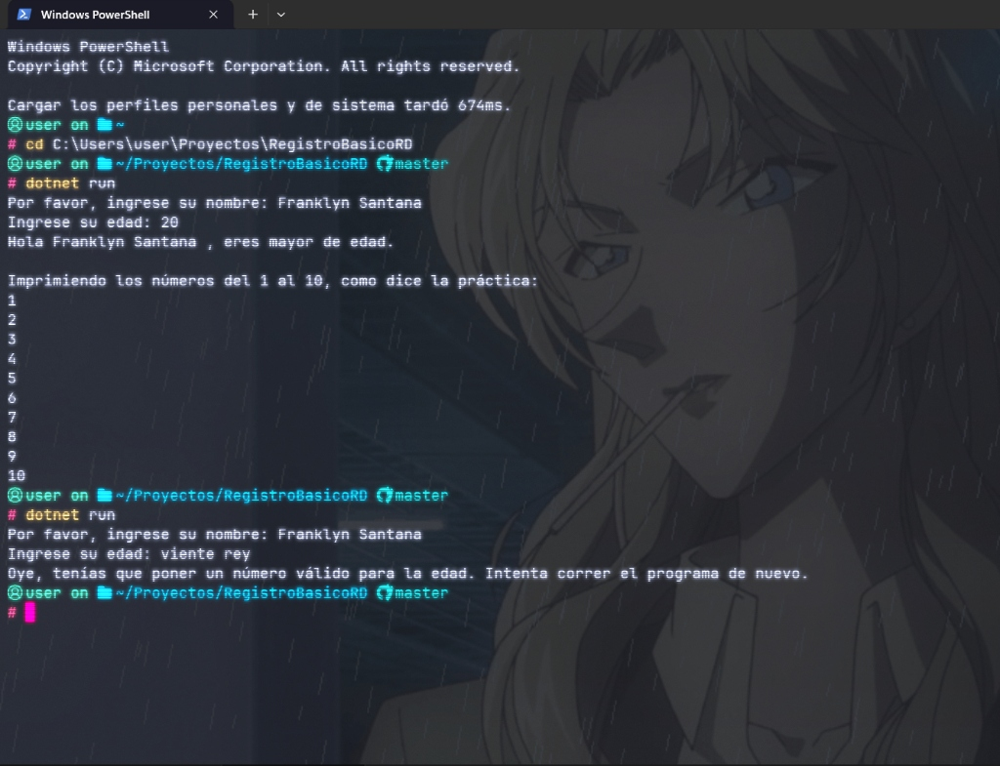

# Práctica Básica C#

Un pequeño programa de consola en C# para poner en práctica conceptos básicos como:
- Lectura de datos por consola (`Console.ReadLine`).
- Conversión de tipos y validación de entrada (`int.TryParse`).
- Condicionales simples (`if-else`).
- Bucles (`for`).

## Vista Previa de Ejecución



## Instrucciones para correrlo

Asegúrate de tener instalado el [SDK de .NET](https://dotnet.microsoft.com/download). 
Abre una terminal en la carpeta del proyecto y ejecuta:

```bash
dotnet run
```


